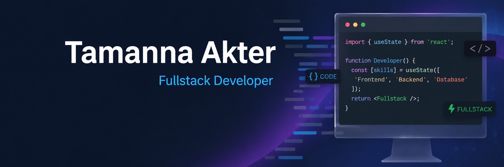

<p align="center">
  
</p>
<p align="center">
  
</p>

<h1 align="center">Hi 👋, I'm Tamanna Akter</h1>

<h3 align="center">Full Stack Developer | MERN Stack Enthusiast</h3>

<p align="center">
Passionate about building responsive, user-friendly, and scalable web applications using modern technologies.
</p>

---

## 🚀 About Me

I'm a Computer Science & Engineering (CSE) student with a strong passion for Web Development. I enjoy creating modern, responsive, and user-friendly web applications. Currently, I'm expanding my skills in the MERN Stack and continuously learning new technologies to become a professional Full Stack Developer.

---

## 🔥 Current Activities

- 🌱 Exploring Next.js and TypeScript
- 🚀 Learning Node.js, Express.js & MongoDB
- 💻 Building Full Stack MERN Projects
- 📚 Improving Backend Development Skills
- ⚡ Solving programming problems and improving coding skills

---

# 💻 Skills

### 🎨 Frontend

<p>

</p>

### ⚙️ Backend

<p>

</p>

### 🛠 Tools

<p>

</p>

---

# 🌐 Connect With Me

<p align="left">

<a href="https://github.com/Tamanna431">

</a>

<a href="https://www.linkedin.com/in/tamanna431">

</a>

<a href="mailto:tamannashuchi06L@gmail.com">

</a>

</p>

---

# 📊 GitHub Stats

<p align="center">


</p>

<p align="center">


</p>

---

# 🏆 GitHub Trophies

<p align="center">


</p>

---

# 📈 Profile Views

<p>


</p>

---

## 💡 Current Focus

```javascript
const tamanna = {
  role: "Full Stack Developer",
  learning: [
    "Next.js",
    "TypeScript",
    "Node.js",
    "Express.js",
    "MongoDB"
  ],
  interests: [
    "Web Development",
    "Backend Development",
    "Open Source"
  ]
};
```

---

<h3 align="center">
⭐ Thanks for visiting my profile! ⭐
</h3>
